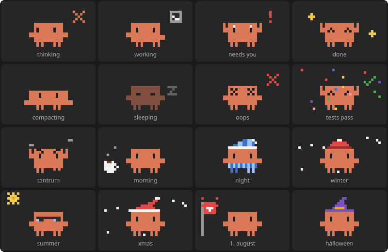

<p align="center">
  
</p>

<h1 align="center">clawd-pet</h1>

<p align="center">Clawd lives now above your prompt in Claude Code 🧡</p>

---

made with the new [Claude Code mods](https://claude.dev/blog/getting-started-with-claude-code-mods/). he watches what claude is doing and reacts to it. happy when tests pass, sleepy when nothing happens and a bit grumpy if you rage too much 😅

works in the terminal and in the desktop app.

## install

you need a Claude Code version with mods (2.1.287 or newer)

```
/plugin marketplace add Revono/clawd-pet
/plugin install clawd-pet@clawd-pet
/reload-plugins
```

if he doesn't show up, restart claude code. then run `/clawd demo` to see all his looks

## what he does



- **working** shows what tool runs right now (terminal, pencil, magnifier, globe…)
- **needs you** jumps and flashes when claude waits for a permission, a question or a plan
- **tests** cheers when they pass, x x eyes when they fail
- **tantrum** if you get frustrated 3 times in 20 min he loses it too. FIX IT?!
- **moods** coffee in the morning, pyjamas at night, seasons and holidays (yes 1. august is in there 🇨🇭)
- **pet him** there is a button. just try it

## commands

```
/clawd                                  show / hide
/clawd demo                             all looks, one after the other
/clawd moods on|off                     seasons, holidays, time of day
/clawd reactions on|off                 oops and test results
/clawd tantrums on|off                  if you don't like to be judged
/clawd hemisphere north|south           so winter is at the right time
```

in a small terminal you get the mini Clawd from the startup banner. give it 64+ columns for the full one with hats and all

## how it works

it's just a mod: one hooks file and the pixel art. no build, no deps. code is in [`plugins/clawd-pet/hooks`](plugins/clawd-pet/hooks). read it first before you install, like with every mod

ideas or a new look for him? open an issue or PR

## privacy

everything stays on your machine. clawd sends nothing anywhere, makes no network calls and starts no other programs.

what he looks at, and why:

- **your prompts** only to spot frustration for the tantrum. never changed
- **tool calls** to show what runs right now (tool name, file name, command or pattern) and to see if tests passed. never changed or blocked, he just watches
- **permission dialogs** (the `PermissionRequest` hook) only to know when claude waits for you, so he can say "Needs you!". he never answers or decides anything, the request goes on unchanged and the dialog works like normal
- **compaction and turn end** to show compacting and done

he saves two small things with claude code's own storage: your `/clawd` settings and how many tools ran today

---

<sub>fan project, not from Anthropic. Clawd is their mascot, i just gave him a home above the prompt</sub>
